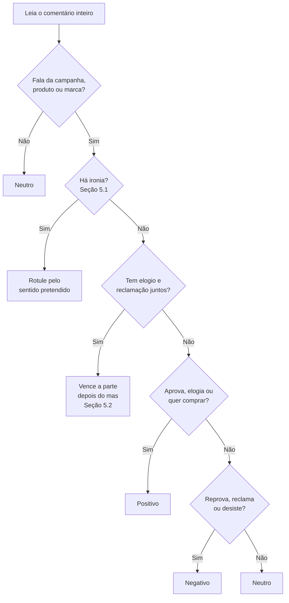

# Manual de Rotulagem — Emi YouTube Analytics

**Versão:** 1
**Data:** 22/09/2026
**Status:** fonte única dos critérios de rotulagem

Este manual é a **fonte única dos critérios**. Os avaliadores humanos o seguem por inteiro; o prompt de rotulagem fraca (`prompt_v1.md`) reproduz as Seções 3, 4, 5 e 6 de forma condensada. As duas réguas precisam ser a mesma — se divergirem, o Kappa entre a Gemini e os humanos mede a diferença entre as réguas, não a qualidade da rotulagem.

> **Ao alterar qualquer critério:** crie `manual_rotulagem_v2.md` e `prompt_v2.md` juntos. Não edite esta versão — os rótulos já gravados foram produzidos por ela.

## 1. Para que serve este manual

Os rótulos que você produzir formam o **gabarito** do projeto: é contra eles que os três métodos de classificação — léxico, BERTimbau e Gemini — serão comparados. Se o gabarito for inconsistente, nenhuma métrica do TCC tem valor.

Três pessoas lendo o mesmo comentário discordam com frequência. Na maior parte das vezes não é porque o comentário é difícil, e sim porque cada uma aplica um critério diferente. Uma acha que "kkkk" é positivo; outra, neutro.

Essa discordância é medida pelo **Kappa de Cohen**. A meta é **κ ≥ 0,60** (concordância substancial). Abaixo disso, o gabarito não pode ser usado e a rotulagem precisa ser refeita.

**Regra de ouro:** na dúvida, não use sua opinião — use o manual. Se o manual não resolver, registre a dúvida (Seção 9). Dúvida registrada melhora o manual; dúvida resolvida por palpite derruba o Kappa.

## 2. Como a rotulagem funciona

Cada avaliador recebe uma planilha com cerca de 334 comentários e marca **uma única classe** por linha. A amostra é estratificada: tem aproximadamente a mesma quantidade de positivos, neutros e negativos.

1. **Rotule às cegas.** Você não vê o rótulo que a Gemini atribuiu nem o dos outros dois avaliadores. Ver qualquer um deles contamina o seu.
2. **Não converse sobre comentários específicos** com os colegas antes de terminar. Discutir casos gera concordância artificial, e o Kappa deixa de medir o critério.
3. **Uma classe por comentário:** positivo, negativo ou neutro. Não existe "misto" nem "não sei" — a Seção 5 diz o que fazer nesses casos.
4. **Marque a coluna de dúvida** quando hesitar, mesmo tendo escolhido uma classe. Isso ajuda a revisar o manual.
5. **Trabalhe em blocos de no máximo 50 comentários,** com pausa entre eles. Cansaço reduz a atenção a ironia e a detalhes.

| Coluna da planilha | O que preencher |
| --- | --- |
| id_comentario | Já vem preenchido — não altere |
| texto | Já vem preenchido — não corrija erros de digitação |
| rotulo | positivo, negativo ou neutro (lista suspensa) |
| duvida | Marque "sim" se hesitou |
| observacao | Opcional: por que hesitou, em poucas palavras |

## 3. As três classes

Cada classe responde a uma pergunta. Leia o comentário e faça a pergunta das três colunas.

| Classe | Pergunta-guia | Exemplos |
| --- | --- | --- |
| **Positivo** | O autor aprova, elogia ou demonstra vontade de comprar? | "que propaganda linda, chorei" · "já comprei o meu, vale muito" · "essa marca nunca decepciona" |
| **Negativo** | O autor reprova, reclama, critica ou desiste da compra? | "caro demais pra qualidade que tem" · "comprei e veio com defeito" · "propaganda mais chata que já vi" |
| **Neutro** | O autor não expressa aprovação nem reprovação? | "tem em outra cor?" · "quanto custa o frete pra SP?" · "vi esse anúncio umas 5 vezes hoje" |

**Neutro não é o "lugar da dúvida".** Neutro é uma classe com critério próprio: ausência de avaliação. Um comentário em que você não sabe decidir entre positivo e negativo **não é neutro** — é um caso difícil, e a Seção 5 tem a regra para ele.

Uma pergunta não é automaticamente neutra. "Alguém mais achou caro demais?" é uma pergunta que carrega reclamação — negativo.

## 4. Regra central: sentimento sobre o quê?

**O sentimento é sempre sobre a campanha, o produto ou a marca anunciada** — nunca sobre qualquer coisa que o comentário mencione. O projeto mede a recepção do anúncio, então é isso que o rótulo precisa refletir.

| Comentário | Rótulo | Por quê |
| --- | --- | --- |
| "odeio segunda-feira, mas esse comercial salvou meu dia" | Positivo | O ódio é pela segunda-feira; sobre o anúncio, é elogio |
| "a atriz é linda demais" | Positivo | Elogio a um elemento da campanha conta como elogio à campanha |
| "os Correios são uma vergonha, meu pedido tá parado" | Negativo | Reclamação sobre a entrega da compra afeta a experiência com a marca |
| "meu cachorro tá dormindo aqui do lado" | Neutro | Não fala da campanha, do produto nem da marca |
| "a música é de qual artista?" | Neutro | Pergunta sem avaliação |

Quando o comentário fala da **entrega, do atendimento ou do preço**, isso conta. São parte da experiência de comprar o produto anunciado, e a própria análise de temas do projeto os trata como aspectos da marca.

## 5. Casos difíceis

É aqui que a concordância se perde. Cada caso tem uma regra de decisão — aplique a regra, não a intuição.

### 5.1 Ironia e sarcasmo

**Regra:** rotule pelo que o autor **quis dizer**, não pelas palavras que usou.

Sinais de ironia: elogio exagerado para algo ruim, palavras em MAIÚSCULAS, "né", "hein", "parabéns", aplausos (👏) depois de uma reclamação.

| Comentário | Rótulo |
| --- | --- |
| "nossa que entrega RÁPIDA hein, só 3 semanas pra chegar 👏👏" | Negativo |
| "parabéns à marca por cobrar 300 reais num tênis de plástico" | Negativo |
| "amei que o produto quebrou no segundo dia, qualidade top" | Negativo |

Se você não tem certeza de que é ironia, rotule pelo sentido literal e marque a coluna de dúvida.

### 5.2 Elogio e reclamação no mesmo comentário (misto)

**Regra:** vence a parte que **encerra** o comentário ou a que vem depois de "mas", "porém", "só que". Ela costuma ser a conclusão do autor.

| Comentário | Rótulo | Por quê |
| --- | --- | --- |
| "bonito sim, mas 2 mil reais num anel banhado? tá de brincadeira" | Negativo | A objeção vem depois do "mas" |
| "demorou pra chegar, mas o produto é maravilhoso" | Positivo | O elogio vem depois do "mas" |
| "gostei do anúncio. o preço é que não dá" | Negativo | A reclamação encerra |

Se as duas partes têm o mesmo peso e não há conectivo, escolha a que fala do **produto** em vez da que fala do anúncio, e marque dúvida.

### 5.3 Gíria e linguagem informal

**Regra:** traduza a gíria antes de rotular. Gíria não é sentimento — é vocabulário.

| Expressão | Sentido usual |
| --- | --- |
| "brabo", "insano", "surreal", "top", "pica" | Positivo |
| "mó paia", "flopou", "fraco", "deu ruim" | Negativo |
| "kkkk", "rsrs", "mds" sozinhos | Neutro — risada sem objeto não avalia nada |

"Mds que anúncio brabo" é positivo. "Mds que caro" é negativo. O "mds" não decide; o resto da frase decide.

### 5.4 Só emoji

**Regra:** emoji isolado vale o sentido dominante dele.

- 😍 🔥 ❤️ 👏 (sem reclamação antes) → Positivo
- 😡 🤮 👎 → Negativo
- 😂 sozinho → Neutro — rir não diz se aprova ou não
- 🤔 → Neutro

### 5.5 Pergunta

**Regra:** pergunta só é neutra se não carregar avaliação.

- "tem pra entrega no Nordeste?" → Neutro
- "alguém mais recebeu com defeito?" → Negativo (pressupõe o problema)
- "onde compro? quero muito" → Positivo (intenção de compra)

### 5.6 Fora do tema

**Regra:** comentário que não fala da campanha, do produto nem da marca é neutro.

Inclui: marcar amigos ("@joao olha isso"), falar de outro assunto, "primeiro!", pedidos de inscrição no canal.

### 5.7 Spam e propaganda de terceiros

**Regra:** neutro, e marque dúvida com a observação "spam". Não descarte o comentário.

Exemplo: "ganhe 500 reais por dia trabalhando de casa, link na bio".

### 5.8 Comentário sobre outro comentário

**Regra:** rotule o que o comentário diz sobre a **campanha**. Se ele só reage a outra pessoa, é neutro.

- "concordo total, também achei caro" → Negativo (endossa a reclamação sobre o produto)
- "você tá louco, o anúncio é ótimo" → Positivo
- "quem ta aqui em 2026?" → Neutro

## 6. Fluxo de decisão

Na dúvida, percorra as perguntas nesta ordem. A primeira resposta "sim" decide o rótulo.

Se ao final você ainda hesita, escolha a classe mais provável e marque a coluna de dúvida. Nunca deixe a linha em branco.

## 7. O que não fazer

- **Não rotule pela sua opinião sobre o produto.** Se você acha o produto caro, isso não torna negativo um comentário que o elogia.
- **Não adivinhe o contexto do vídeo.** Rotule só pelo texto. Se o sentido depende de algo que só quem viu o vídeo sabe, marque dúvida.
- **Não corrija o texto.** Erros de digitação e abreviações ficam como estão — o modelo vai encontrar os mesmos erros em produção.
- **Não pule comentários.** Linha vazia na planilha quebra o cálculo do Kappa. Todo comentário recebe uma classe.
- **Não consulte a Gemini nem outra IA** para decidir. O gabarito precisa ser humano; é isso que torna a comparação válida.
- **Não mude o rótulo depois de conversar com os colegas.** O Kappa mede o critério individual. Revisões acontecem só no desempate (Seção 9).

## 8. Exercício de calibração

Antes da amostra oficial, os três avaliadores rotulam os 12 comentários abaixo **sozinhos**, sem olhar o gabarito. Depois comparam entre si e com o gabarito.

Se algum avaliador errar mais de 3, releia as Seções 4 e 5 antes de começar a amostra oficial. A calibração não entra no cálculo do Kappa.

| # | Comentário |
| --- | --- |
| 1 | "chorei com esse comercial, que lindo" |
| 2 | "mds que caro, nem fodendo que eu pago isso" |
| 3 | "alguém sabe se entrega em Manaus?" |
| 4 | "que atendimento EXCELENTE, esperei só 2 horas no chat 👏" |
| 5 | "produto bom mas a entrega atrasou uma semana" |
| 6 | "a entrega atrasou mas o produto é perfeito" |
| 7 | "😂😂😂" |
| 8 | "brabo demais esse anúncio" |
| 9 | "@mariana olha isso aqui" |
| 10 | "alguém mais recebeu com a tampa quebrada?" |
| 11 | "onde compro? preciso desse" |
| 12 | "ganhe dinheiro em casa, link na bio" |

### Gabarito

| # | Rótulo | Regra aplicada |
| --- | --- | --- |
| 1 | Positivo | Elogio direto à campanha (Seção 3) |
| 2 | Negativo | Gíria traduzida: recusa pelo preço (Seção 5.3) |
| 3 | Neutro | Pergunta sem avaliação (Seção 5.5) |
| 4 | Negativo | Ironia: maiúsculas + aplauso após reclamação (Seção 5.1) |
| 5 | Negativo | Vence a parte depois do "mas" (Seção 5.2) |
| 6 | Positivo | Vence a parte depois do "mas" (Seção 5.2) |
| 7 | Neutro | Risada sem objeto (Seção 5.4) |
| 8 | Positivo | Gíria positiva (Seção 5.3) |
| 9 | Neutro | Marcar amigo é fora do tema (Seção 5.6) |
| 10 | Negativo | Pergunta que pressupõe defeito (Seção 5.5) |
| 11 | Positivo | Intenção de compra (Seção 5.5) |
| 12 | Neutro | Spam, com dúvida marcada (Seção 5.7) |

Repare nos pares 5 e 6: as mesmas palavras em ordem inversa dão rótulos opostos. Se os três avaliadores acertarem esses dois, a regra do "mas" foi entendida.

## 9. Desempate e revisão do manual

Depois que os três terminam, o Kappa é calculado **antes** de qualquer discussão. Só então a equipe olha as divergências.

1. **Maioria decide.** Quando dois dos três concordam, o rótulo da maioria vira o gabarito.
2. **Empate total** (cada um marcou uma classe diferente) vai para reunião de consenso. A decisão e o motivo são registrados.
3. **Comentários marcados com dúvida por dois ou mais avaliadores** são revisados em conjunto, mesmo que tenham concordado no rótulo. Eles apontam onde o manual precisa melhorar.

### Se o Kappa ficar abaixo de 0,60

Não é falha dos avaliadores — é sinal de que o manual deixou um caso sem regra. O procedimento:

1. Liste os comentários com mais divergência.
2. Identifique o padrão que eles têm em comum (ironia? pergunta? comentário misto?).
3. Escreva uma regra nova ou mais clara para esse padrão, numa nova versão do manual.
4. Refaça a rotulagem com uma **nova amostra** — rotular de novo os mesmos comentários mediria memória, não critério.

### Registro de dúvidas

Toda dúvida anotada na planilha é copiada para esta tabela, para orientar a próxima versão do manual.

| Comentário | Dúvida | Decisão tomada | Regra criada ou ajustada |
| --- | --- | --- | --- |
|  |  |  |  |
